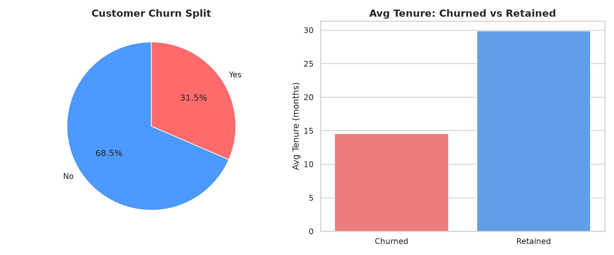
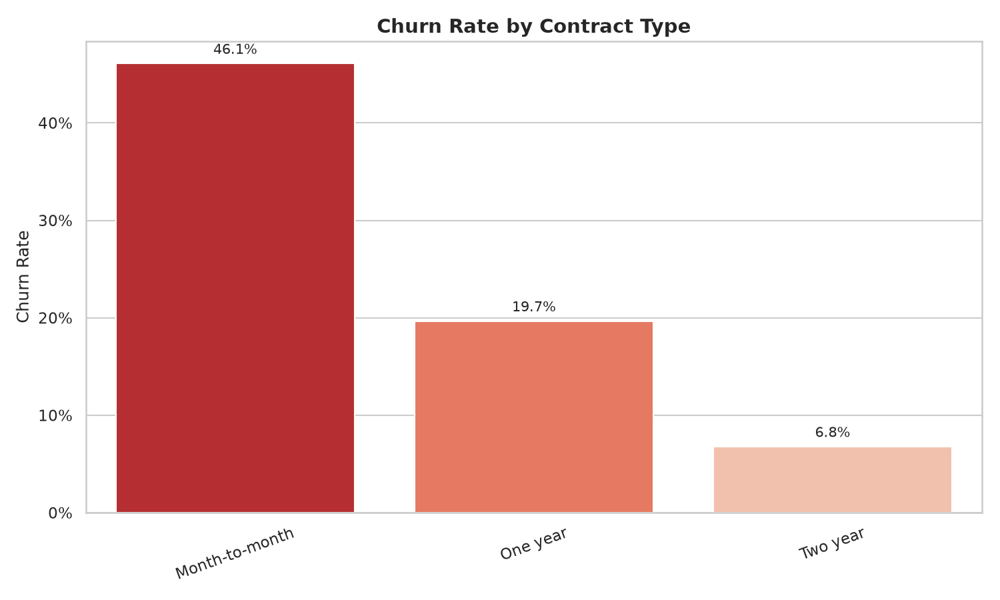
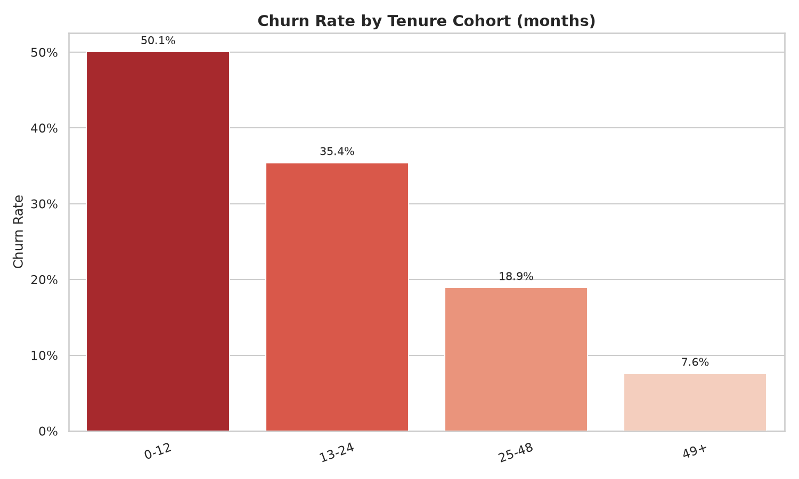
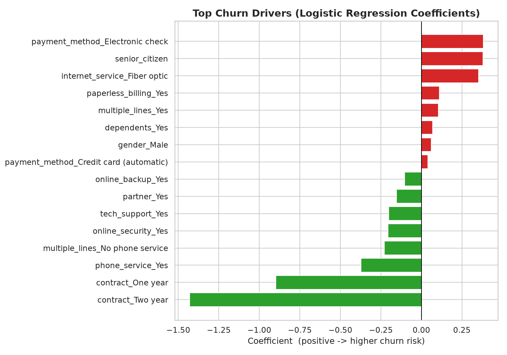
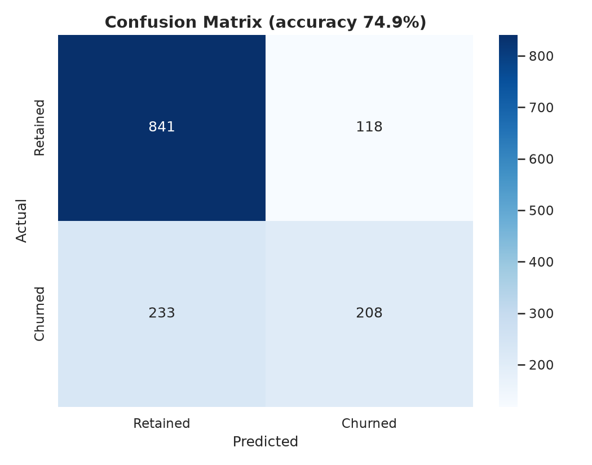
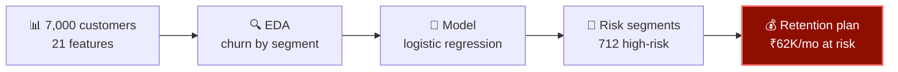

<div align="center">
  
</div>

<p align="center">
  
</p>

<p align="center">
  
  
  
  
  
  
</p>

> **31.5% of customers are churning**, and over a third of monthly revenue walks out the door with them. This project finds out *who* leaves, *why*, and *which 712 customers* a retention campaign should call first.

---

## 📊 The headline numbers

| Metric | Value |
|---|---|
| Customers analyzed | 7,000 |
| Overall churn rate | **31.5%** |
| Monthly revenue at risk | **₹1,62,148** (34.8% of revenue) |
| Avg tenure — churned vs retained | 14.6 vs 29.9 months |
| Model test accuracy | 74.9% |



## 🔑 Finding #1 — the contract is the lever

Month-to-month customers churn at **46.1%**. Two-year contracts: **6.8%**. Contract type is the strongest coefficient in the model — nothing else comes close.



## ⏳ Finding #2 — the first year is the danger zone

Customers in months 0–12 churn at **~56%**. Survive past year four and it drops to **~9%**. Retention isn't a general problem — it's an onboarding problem.



## 🎯 Finding #3 — the 712 worth calling first

Stack the risk factors — month-to-month **+** fiber optic **+** no tech support **+** tenure ≤ 12 months — and you get **712 customers (10.2% of the base) churning at 68%**, with **₹62,098/month** of revenue at risk. That's not a segment, that's a call list.



## 🤖 The model

Logistic regression on engineered tenure/cohort features. Not the fanciest algorithm — deliberately: in churn, *explainability beats accuracy*, because the retention team needs to know **why** someone is flagged.



---

## ⚙️ How it works



## 📂 What's inside

```
├── generate_data.py              # synthetic customer base, seed 42
├── analysis.py                   # EDA → model → segments → charts
├── build_notebook.py             # builds the notebook from the pipeline
├── Customer_Churn_Analysis.ipynb # narrated case-study notebook (34 cells)
├── findings.md                   # stakeholder summary
├── data/
│   └── telecom_churn.csv         # 7,000 customers × 21 columns
└── visuals/                      # 9 charts (shown above)
```

## ▶️ Run it

```bash
pip install -r requirements.txt
python3 generate_data.py    # build the dataset
python3 analysis.py         # full analysis + 9 charts
```

Or open the notebook — same analysis, narrated step by step. Deterministic: rebuild from scratch, every number reproduces exactly.

---

## 🔭 Where I'd take it next

- **Uplift modeling** — predict *who responds to retention offers*, not just who churns. Calling everyone wastes money; calling the persuadable saves it.
- **Survival analysis** — model *time-to-churn* (Cox PH) instead of binary churn, so campaigns fire *before* risk peaks.
- **Offer ROI simulator** — price discount vs. saved lifetime value per segment; find the retention spend that pays for itself.

---

*Synthetic customer base (seed 42) with realistic churn behavior — short tenure, month-to-month contracts, and fiber-without-support all raise risk, mirroring real telecom patterns. Pipeline works identically on live data.*

<div align="center">
  
</div>
